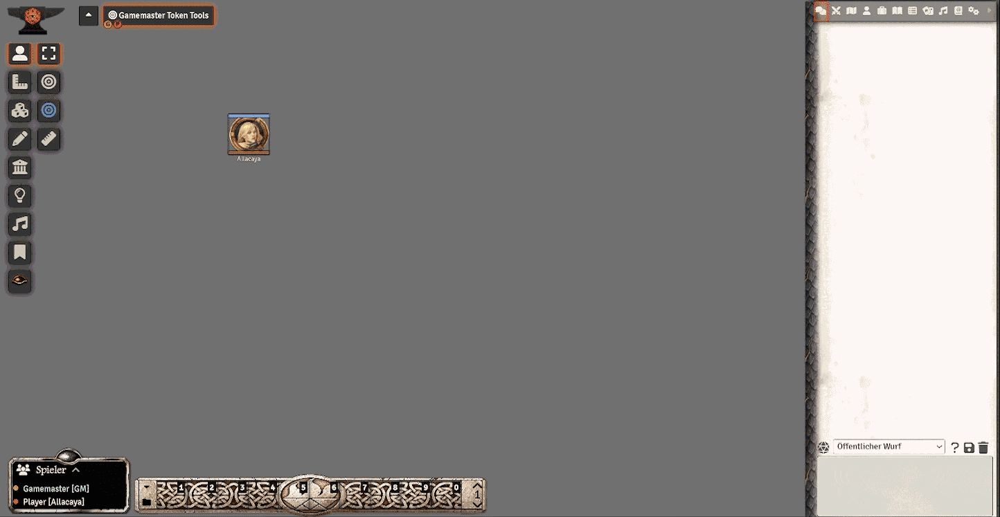

# Gamemaster Token Tools for DSA5

Gamemaster Token Tools for TdE5, showing infos, actions and call-for-actions on a token HUD.

# Features
- Have various, configurable actions when clicking:
  - Request a roll from the selected token's player via chat.
  - Request a roll from all players via chat.
  - Open a dialog for configuring options for a given roll request before requesting that roll.
  - Roll the check yourself and display the outcomes to either the token's player or everyone.
- Request rolls for skills, attributes and health related attributes.
- Roll damage for a token or heal in place.
- Select kind of damage:
  - Generic damage.
  - Fall damage
  - Fire- or Acid damage.
  - Frost damage.
  - Heat damage.
- Show a quick overview of walking/dash speed, current XP and armor rating for the gamemaster and/or the token owning players.

# Installation

## Method 1
1. On Foundry VTT's **Configuration and Setup** screen, go to **Add-on Modules**
2. Click **Install Module**
3. Search for **Gamemaster Token Tools for DSA5** 
4. Click **Install** next to the module listing

## Method 2
1. On Foundry VTT's **Configuration and Setup** screen, go to **Add-on Modules**
2. Click **Install Module**
3. In the Manifest URL field, paste: `https://github.com/BlackStripedOne/fvtt-gm-token-tools/releases/latest/download/module.json`
4. Click **Install** next to the pasted Manifest URL

## Required Modules

Currently the tools are independant of other modules. It only requires the game system for **DSA 5th Edition** to be installed.

# Support

For questions, feature requests or bug reports, please open an issue [here](https://github.com/BlackStripedOne/fvtt-gm-token-tools/issues).

Pull requests are welcome. Please include a reason for the request or create an issue before starting one.

# Acknowledgements

Thanks to the Foundry VTT Developers as well as Ulissis to give us such an awesome platform to play our VTT on.

# License

This Foundry VTT module is licensed under a [Creative Commons Attribution Share Alike 4.0 International](https://choosealicense.com/licenses/cc-by-sa-4.0/) and this work is licensed under [Foundry Virtual Tabletop EULA - Limited License Agreement for module development](https://foundryvtt.com/article/license/).

*****

# Gamemaster Token Tools für DSA5

Gamemaster Token Tools für DSA5, um Informationen und Aktionen zu einem ausgewählten Token direkt via HUD zu zeigen oder initiieren.

# Möglichkeiten und Funktionen
- Die folgenden Aktionen können frei konfiguriert werden, für einen Click:
  - Erbitte einen Probenwurf von des Token's Spieler direkt über den Chat.
  - Erbitte einen Probenwurf von allen Spielern direkt über den Chat.
  - Öffne zuvor einen Dialog, indem die Eigenschaften des Probenwurfes näher spezifiziert werden können.
  - Rolle den Probenwurf als Spielleiter direkt für den Token aus und zeige das Ergebnis entweder im Chat an den Spieler des Tokens oder alle.
- Erfrage Proben auf Talente des Charakters oder Talente.
- Würfle speziellen Schaden mit erweiterten Optionen direkt für einen Token oder erbitte einen Regenerations-Wurf.
- Verschiedene Schadensarten haben individuelle Einstellungen:
  - Allgemeiner Schaden vom Spielleiter festlegbar.
  - Fallschaden mit Sonderregeln.
  - Feuer- oder Säureschaden mit Sonderregeln.
  - Kälteschaden mit Sonderregeln.
  - Hitzeschaden mit Sonderregeln.
- Zeige einen kompakten Überblick über die Laufentfernung pro KR, aktuelle APs sowie die Rüstungswerte am Token HUD. Sichtbar für Spielleiter oder auch Spieler.

# Installation

## Methode 1
1. Auf Foundry VTT's **Configuration and Setup** Seite, gehe zu dem Punkt **Add-on Modules**
2. Clicke auf **Install Module**
3. Suche nach **Gamemaster Token Tools for DSA5** 
4. Clicks **Install** direkt neben dem aufgelisteten Modul

## Methode 2
1. Auf Foundry VTT's **Configuration and Setup** Seite, gehe zu dem Punkt **Add-on Modules**
2. Clicke **Install Module**
3. In dem Freitext Feld für die Manifest URL, füge den folgenden Link ein: `https://github.com/BlackStripedOne/fvtt-gm-token-tools/releases/latest/download/module.json`
4. Clicke **Install** direkt neben der eingefügten Manifest URL

## Erforderliche Module

Aktuell benötigen die Tools kein weiteres Modul ausser dem Spielesystem **DSA 5th Edition**, welches installiert und aktiviert sein muss.

# Unterstützung

Für Fragen, Anregungen oder Fehler, öffne ein issue [hier](https://github.com/BlackStripedOne/fvtt-gm-token-tools/issues).

Pull requests sind ebenso willkommen. Bitte füge einen Grund für den Pull hinzu oder erzeuge zuerst ein Issue dafür, um zu sehen ob dies überhaupt zu dem Modul passt.

# Danksagungen

Ein grosses Danke an die Foundry VTT Entwickler, sowie Ulissis Spiele, die uns eine solch tolle Plattform für VTT Spiele ermöglicht haben.

# Lizenz

Dieses Foundry VTT Modul steht sowohl unter der [Creative Commons Attribution Share Alike 4.0 International](https://choosealicense.com/licenses/cc-by-sa-4.0/) als auch der [Foundry Virtual Tabletop EULA - Limited License Agreement for module development](https://foundryvtt.com/article/license/) Lizenz.